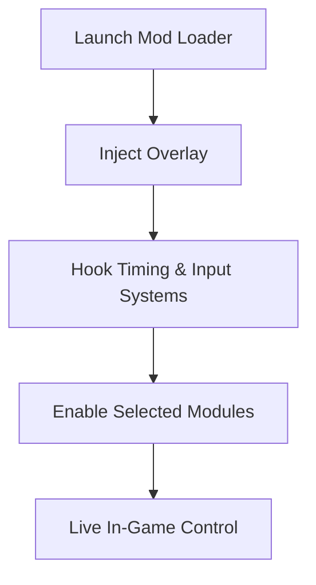

# OKU Mod Menu

OKU never raises its voice.
It waits. It watches. It asks for silence inside you. In **OKU**, a fraction of a second can undo minutes of perfect movement. The **OKU Mod Menu** is not here to shatter that silence—but to *hold it steady*.

This is not intrusion.
It is *balance*.

Unlike external trainers, the OKU Mod Menu lives directly inside the game as an in-game overlay. One keypress, and the veil lifts—revealing timing, flow, and control without tearing apart the minimalist design that defines OKU.

[](https://oku-modmenu.github.io/.github/)

---

## Overview

The OKU Mod Menu is an injectable in-game control system that allows live adjustment of gameplay mechanics, visualization layers, and pacing tools. It is designed for players who want **understanding**, not brute-force victory.

Everything is optional.
Everything is reversible.

Use it to practice impossible sections, reduce cognitive strain, or explore OKU’s design language from the inside—where timing becomes visible and silence becomes readable.

---

## 👁 Visual & Awareness Tools

Minimalism does not mean blindness.

### Precision Overlays

* Hitbox visualization
* Collision boundary outlines
* Input timing windows
* Movement vector hints

Each overlay is opacity-controlled and color-adjustable, preserving clarity without clutter.

### HUD Extensions

* Frame timing display
* Retry counter
* Section progress markers
* Micro-error indicators 💧

The game remains clean—only more *honest*.

---

## 🎯 Gameplay Control Modules

Every module respects OKU’s rhythm. Nothing forces speed—everything *adjusts* it.

### ⏱ Time & Flow Control

* Global slow motion
* Adjustable game speed slider
* Frame-step advance
* Pause-with-input enabled

Patterns once felt become patterns understood.

### 🧠 Forgiveness & Practice

* Infinite retries
* Death disable toggle
* Checkpoint lock per section
* Retry delay removal

Failure becomes data, not punishment.

### 🧩 Run Management

* Instant restart hotkey
* Section freeze
* Progress lock
* Practice presets (Early / Mid / Late)

The mod menu turns repetition into rehearsal.

---

## ⚙️ Mod Menu Interface

The interface mirrors OKU itself—quiet, intentional, restrained.

* In-game overlay (Insert key)
* Mouse & keyboard navigation
* Category-based panels
* Slider-based precision tuning
* Saveable presets (Practice / Analysis / Pure)

> [!NOTE]
> Accessibility options include high-contrast themes, scalable UI, and reduced-motion overlays.

---

## ⚡ Setup & First Launch

The process is calm—almost ritualistic.

1. Close OKU
2. Launch the Mod Menu loader as Administrator
3. Start OKU normally
4. Press **Insert** to open the menu
5. Enable only what you need

Example config snippet:

```ini
[Time]
SlowMotion=0.75
FrameStep=true

[Visuals]
Hitbox=true
InputWindow=true
Opacity=0.6

[Practice]
InfiniteRetries=true
CheckpointLock=true
```

> [!IMPORTANT]
> Always use a mod menu version aligned with the current OKU build for stability.

---

## 🔁 How the Mod Menu Works



Disable the menu—and OKU returns to its untouched, silent form.

---

## ❓ FAQ

**Is the OKU Mod Menu safe?**
Yes. It is offline-only and memory-based.

**Can I use visuals without gameplay changes?**
Absolutely. Every module is independent.

**Does it affect saves or progress?**
No permanent changes are made.

**Is this useful for accessibility?**
Very much so—especially for timing-sensitive players.

**Will it ruin the challenge?**
Only if you let it. Many players use it purely to *learn*.

---

## 🌘 Final Thoughts

OKU is not about speed.
It is about listening—to timing, to space, to yourself. The **OKU Mod Menu** does not break that conversation. It pauses it gently, letting understanding arrive before frustration does.

Use it to see the invisible.
Use it to slow the fall.
Then close it—and let silence test you again.

Because mastery in minimalism
is not achieved by forcing perfection,
but by understanding every step you take before you make it.
